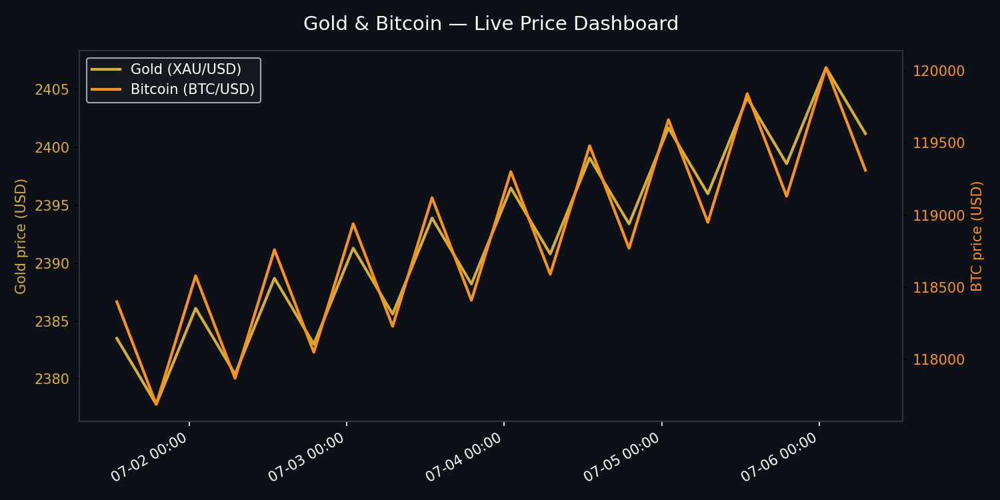

# Market Tracker — Gold & Bitcoin

A fully automated pipeline that logs gold (XAU/USD) and Bitcoin (BTC/USD) prices on a schedule, tracks the history in version control, and renders an auto-updating dashboard chart — no server, no manual steps.



## What it does

- **Fetches** live prices for gold and BTC four times a day on weekdays via GitHub Actions
- **Logs** each snapshot to CSV (`data/gold_prices.csv`, `data/btc_prices.csv`)
- **Renders** a dual-axis chart (`assets/dashboard.png`) on every run, so this README always shows current data
- **Commits automatically** — the whole loop runs unattended

## Architecture

```
.github/workflows/track.yml   → scheduled trigger, orchestrates the pipeline
scripts/fetch_prices.py       → pulls gold price (Alpha Vantage) + BTC price (CoinGecko)
scripts/generate_chart.py     → renders data/*.csv into assets/dashboard.png
data/                         → append-only price history
assets/                       → generated chart output
```

## Data sources

| Asset | Source | Auth |
|---|---|---|
| Gold (XAU/USD) | [Alpha Vantage](https://www.alphavantage.co/) | Free API key required |
| Bitcoin (BTC/USD) | [CoinGecko](https://www.coingecko.com/en/api) | No key required |

## Running it yourself

1. Get a free Alpha Vantage API key: https://www.alphavantage.co/support/#api-key
2. Fork or clone this repo
3. Add it as a repository secret: **Settings → Secrets and variables → Actions**
   - `ALPHAVANTAGE_KEY` = your key
4. Push to GitHub — the workflow runs automatically on schedule (or trigger manually from the **Actions** tab)

To run locally:
```bash
pip install -r requirements.txt
export ALPHAVANTAGE_KEY=your_key_here
python scripts/fetch_prices.py
python scripts/generate_chart.py
```

## Why I built this

Wanted a lightweight way to practice scheduled automation, API integration, and clean data pipelines end-to-end — fetch, store, visualize, repeat, with zero infrastructure to maintain.
